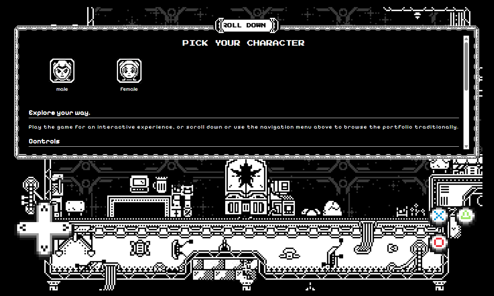

# 🎮 Portfolio Game

<p align="center">
  
  
  
  
  
</p>

---

## About

**Portfolio Game** is an experimental web game built with **Kaplay** as part of my personal portfolio.

The project is still in active development, and both the gameplay mechanics and visual style may change significantly as development progresses.

The primary goal of this project is to become an interactive showcase inside my portfolio website, demonstrating both game development and front-end engineering in a single experience.

---

## Screenshot

<p align="center">
  
</p>

---

## Features

* 🎮 Built with **Kaplay**
* 🌐 Integrated directly into a web portfolio
* 📡 Event-driven communication between the website and the game
* 🖥️ Game rendered inside an HTML Canvas
* 🎛️ Menus and UI rendered as standard web components
* 🧠 Centralized game state for easier debugging and maintenance
* 🚧 Designed with future expansion in mind

---

## Architecture

The game and the website communicate through a **custom Event Bus**.

This allows the web application to control and interact with the game without tightly coupling the two systems.

```text
Website UI
     │
     ▼
Custom Event Bus
     │
     ▼
Kaplay Game
```

Examples of interactions include:

* Opening and closing menus
* Triggering in-game actions
* Updating UI elements
* Synchronizing game state with the website

---

## Rendering Strategy

To keep responsibilities separated and the architecture maintainable:

* **Game world** is rendered inside an HTML Canvas using **Kaplay**.
* **GUI elements** such as menus, dialogs, overlays, and mobile controls are rendered as regular web components.

This approach makes the interface easier to customize while allowing the game engine to focus solely on gameplay.

---

## State Management

The game's state is fully centralized.

This architecture simplifies:

* Debugging
* Feature development
* Event synchronization
* Future scalability

As the project grows, a centralized state makes it easier to add new mechanics without introducing unnecessary complexity.

---

## Project Status

The project is currently **work in progress**.

At the moment, my primary focus is completing the core features of my portfolio website before fully shifting attention to the game itself.

Since the game is intended to become an interactive showcase within the portfolio, the website naturally takes priority during this stage of development.

---

## Tech Stack

* **Kaplay**
* **TypeScript**
* **HTML5 Canvas**
* **Custom Event Bus**
* **Modern Web APIs**

---

## Roadmap

* [ ] Core player mechanics
* [ ] Enemy AI
* [ ] Combat system
* [ ] Save system
* [ ] Sound effects & music
* [ ] Improved visual effects
* [ ] Mobile controls
* [ ] Portfolio integration
* [ ] Complete showcase experience

---

## License

This project is currently under development and is intended as a personal portfolio showcase.
